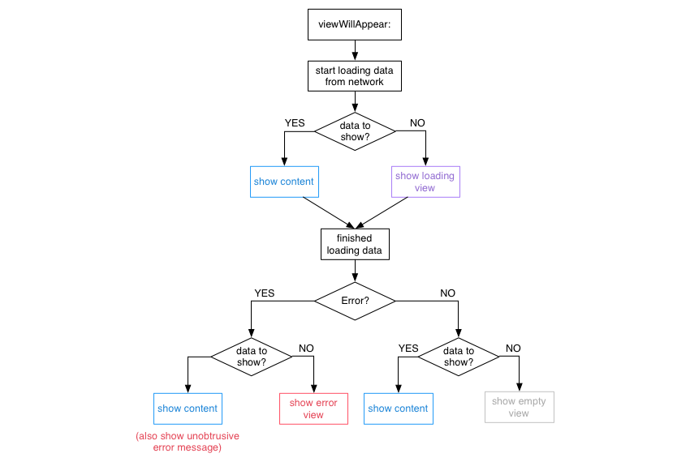

# BXYStatefulViewController

[](https://travis-ci.org/bxyfighting/BXYStatefulViewController)
[](http://cocoapods.org/pods/BXYStatefulViewController)
[](http://cocoapods.org/pods/BXYStatefulViewController)
[](http://cocoapods.org/pods/BXYStatefulViewController)

A view controller category that presents placeholder views based on content, loading, error or empty states.

## Overview
In a networked application a view controller typically has the following states that need to be communicated to the user:

* Loading: The content is currently loaded over the network.
* Content: The content is available and presented to the user.
* Empty: There is currently no content available to display.
* Error: An error occurred whilst downloading content.

As trivial as this flow may sound, there are a lot of cases that result in a rather large decision tree.



BXYStatefulViewController is a concrete implementation of this particular decision tree.

## Installation

BXYStatefulViewController is available through [CocoaPods](http://cocoapods.org). To install
it, simply add the following line to your Podfile:

```ruby
pod 'BXYStatefulViewController'
```

## Author

bxyfighting, bxyfighting@163.com

## License

BXYStatefulViewController is available under the MIT license. See the LICENSE file for more info.
